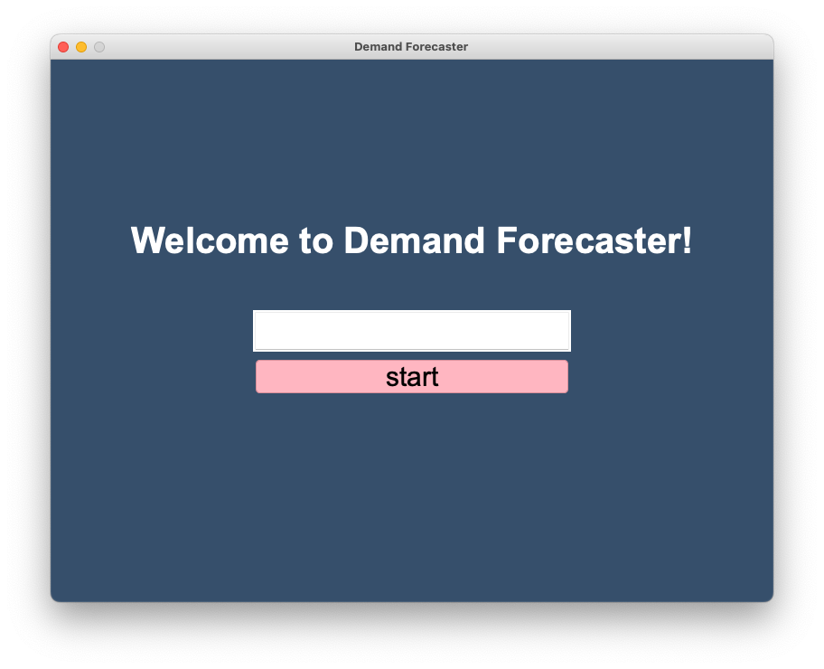
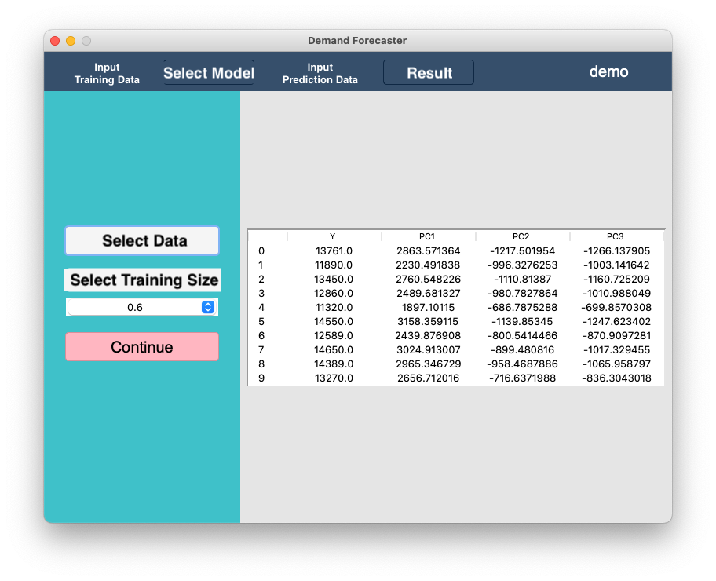
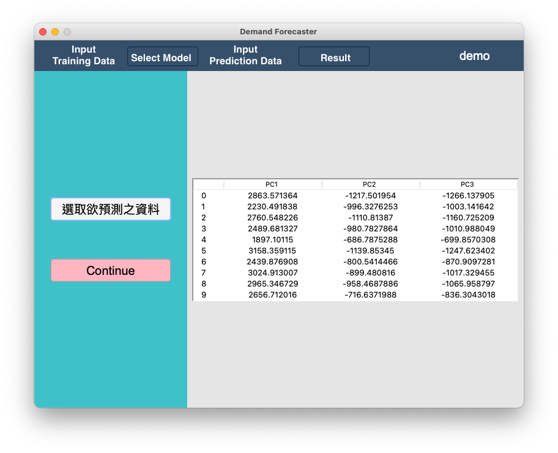
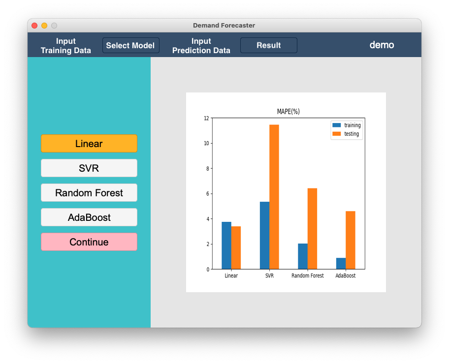
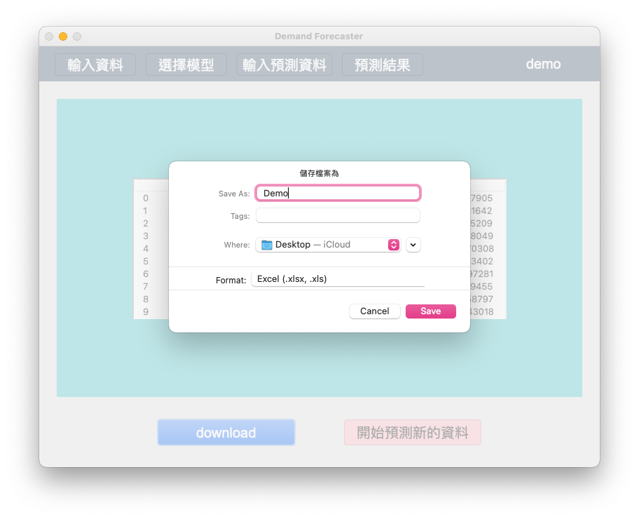

# 📈 Semiconductor Raw Material Demand Forecasting Platform

This project delivers a forecasting platform designed specifically for the semiconductor industry. In light of rising global instability—such as the U.S.–China trade tensions, Japan–Korea export controls, and the COVID-19 pandemic—accurate demand prediction for raw materials has become critical.

Taiwan, a major player in global chip manufacturing, relies heavily on imported high-purity materials. Even minor disruptions in supply can cause costly production delays and inventory strain. This project addresses that challenge by applying both classical time series techniques and modern machine learning models to forecast material requirements—helping businesses build supply chain resilience.

---

## 🎯 Objective

To develop an intuitive desktop application that:
- Forecasts demand for critical semiconductor materials
- Compares traditional and machine learning model performance
- Allows business users to upload data, analyze trends, and generate forecasts through a visual interface

---

## 🧪 Techniques & Tools

### 🔮 Forecasting Approaches

**Traditional Time Series Models:**
- Simple Moving Average (SMA)
- Simple Exponential Smoothing (SES)
- Autoregressive Models (AR)
- ARIMA (AutoRegressive Integrated Moving Average)

**Machine Learning Models:**
- Multiple Linear Regression (MLR)
- Nonlinear Regression
- Random Forest
- Support Vector Machines (SVM)
- Adaptive Boosting (AdaBoost)

### 🖥️ Technologies
- **Programming Language:** Python  
- **Libraries:** `pandas`, `scikit-learn`, `statsmodels`, `matplotlib`, `tkinter`  
- **Interface:** Tkinter-based GUI  
- **Data:** Simulated data from a real-world semiconductor manufacturer

---

## 🧩 GUI Demo

Upload data, compare models, and visualize predictions—all within the app.

📷 **User Interface Preview**  






---

## 🚀 Features

- Interactive GUI for uploading and analyzing data
- Model selection based on Mean Absolute Percentage Error (MAPE)
- Bar chart visualization of training results
- Supports `.xlsx`, `.xls`, and `.csv` file formats
- Adjustable training size (60%–90%)
- Export predictions directly to Excel

---

## ⚙️ Setup Instructions

### 1. Clone the Repository

```bash
git clone https://github.com/mocalucy/project.git
cd project
```

### 2. Install Dependencies

```bash
pip install -r requirements.txt
```

---

## ▶️ Usage

To launch the app:

```bash
python GUI.py
```

### Workflow:
1. Enter project name
2. Upload training dataset (Excel or CSV)
3. Select training size (e.g., 80%)
4. Compare model performance
5. Select a model and upload test data
6. Predict and export results

---

## 📊 Data Format

**Training Data**
- Accepted formats: `.xlsx`, `.xls`, `.csv`
- Column 1: Target variable (e.g., demand)
- Columns 2...N: Feature variables

**Test Data**
- Must match the feature column structure of training data

---

## 📁 Project Structure

```plaintext
.
├── GUI.py               # Main GUI application
├── forecast_faster.py   # Model training and forecasting logic
├── setting.py           # UI configuration and parameters
├── requirements.txt     # Python dependencies
└── GUI_image/           # Demo screenshots for README
```

---

## 📌 Notes

- Best model is automatically selected based on MAPE
- Model performance comparison is shown visually
- Exported results are saved as Excel files for downstream use

---

## 📫 Maintainer

Created and maintained by [@mocalucy](https://github.com/mocalucy).  
Feel free to star ⭐, fork 🍴, or contribute 🛠️!
